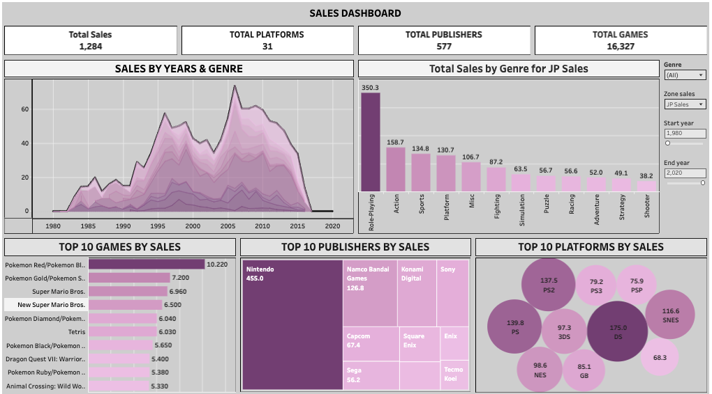

# Video Game Sales Analytics Dashboard

## Project Overview
This project involves a comprehensive analysis of the Video Game Sales dataset, visualized using **Tableau**. The dashboard provides a high-level overview of the video game industry, tracking key performance indicators (KPIs) and uncovering trends across different regions, genres, platforms, and publishers.

The goal of this dashboard is to assist stakeholders in understanding market dynamics, identifying best-selling titles, and recognizing dominant publishers and platforms.

## Dashboard Screenshot

## Tableau Public Link
[View Interactive Dashboard](https://public.tableau.com/views/Sales_Dashboard_17652520223560/Dashboard1?:language=en-US&:sid=&:redirect=auth&:display_count=n&:origin=viz_share_link)

## Key Features & Visualizations

The dashboard includes the following interactive visualizations:

### 1. KPI Overview
- **Total Sales:** Aggregate global sales figures.
- **Total Games:** Count of unique game titles analyzed.
- **Total Platforms:** Number of distinct gaming consoles/platforms.
- **Total Publishers:** Count of active publishers in the dataset.

### 2. Market Leaders Analysis
- **Top 10 Names by Sales:** A ranking of the highest-grossing video games of all time.
- **Top 10 Platforms by Sales:** Identification of the most commercially successful gaming consoles.
- **Top 10 Publishers by Sales:** highlighting the industry giants driving the market.

### 3. Trend & Genre Analysis
- **Sales by Years and Genre:** A temporal analysis showing how sales distributions across genres have evolved over time.
- **Total Sales by Genre:** A breakdown of market share by game genre (Action, Sports, Shooter, etc.).

## Key Insights
*   **Genre Dominance:** Analysis of which genres (e.g., Action, Sports) consistently outperform others in terms of global sales.
*   **Platform Wars:** Insights into the lifecycle and market share of major consoles (PlayStation, Xbox, Nintendo).
*   **Publisher Performance:** Identification of key publishers that maintain a monopoly on top-tier sales.
*   **Historical Trends:** Observation of the "Golden Age" of video game sales and year-over-year growth patterns.

## Tools & Technologies Used
- **Tableau Public / Desktop:** For creating interactive dashboards and specific visualizations.
- **Data Source:** `vgsales.csv` / `vgsales.hyper` (Video Game Sales Dataset).
- **Data Cleaning & Preparation:** Handling missing values and formatting data for optimal visualization.

## Author
Shubham Kulkarni

